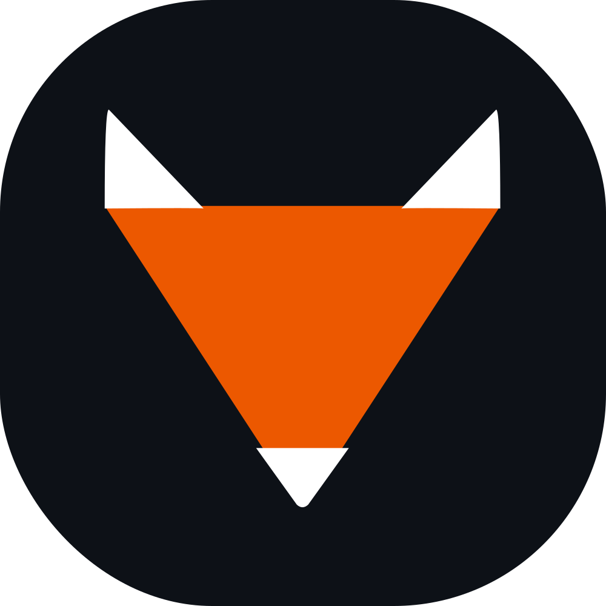

  
  <h1>Lexinari</h1>
  
<b>Transform your language learning from passive to active.</b>

## What we're building

- **Lexinari Web**: A seamless interface to organize and save words you find while immersing in a language with context, meanings, and a way to export directly to your favorite study tool (like Anki).
- **Multilingual Support**: Built to handle learning multiple languages performantly.
- **Progress Tracking**: Visualize your consistency with a **90-day activity heatmap** to stay motivated and on track.
- **Data Ownership**: Full **import and export backup** support, ensuring your data is always yours and never locked in a single platform.

## The Goal

To build the fastest path from "unknown word" to "flashcard," so you can spend less time managing data and more time actually learning.

[Coming Soon](https://lexinari.com)
